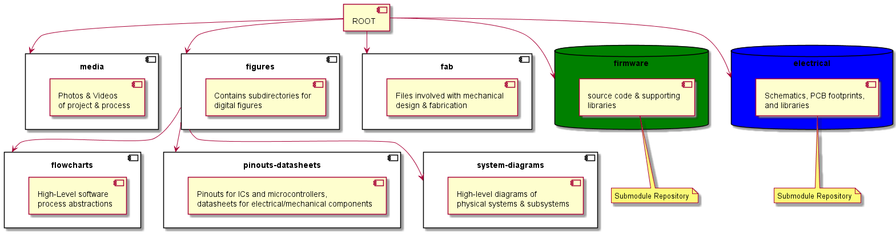
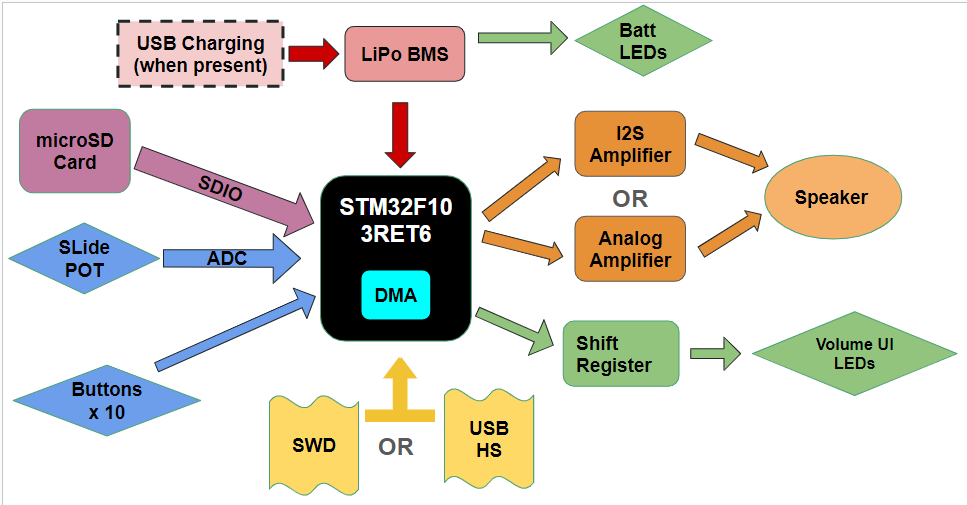
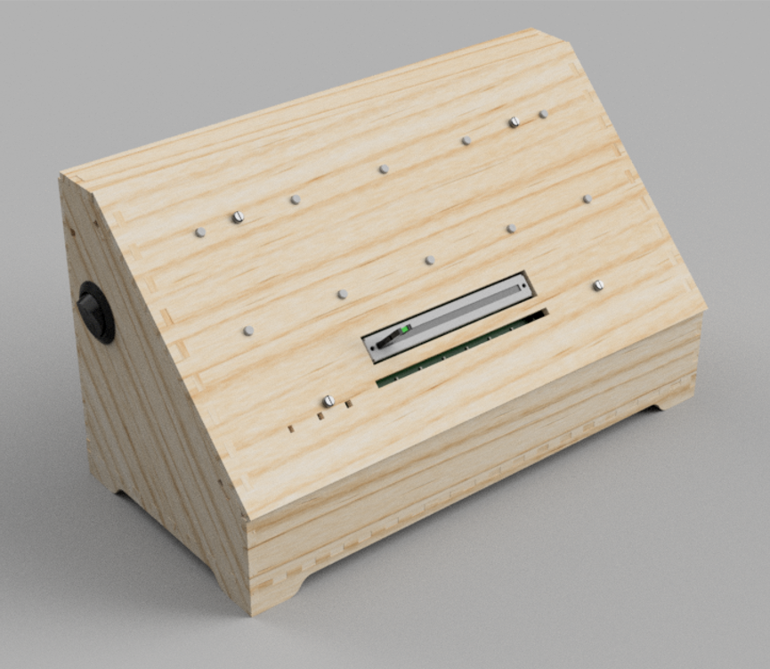

<Desc.>

#### A full detailing can be found [here](https://www.markhofmeister.com/stm32-audio-dev-panel) 

## Directory Structure 

## System Diagram

## Flowchart 

 
 
 
 
 

## Mechanical View
	
