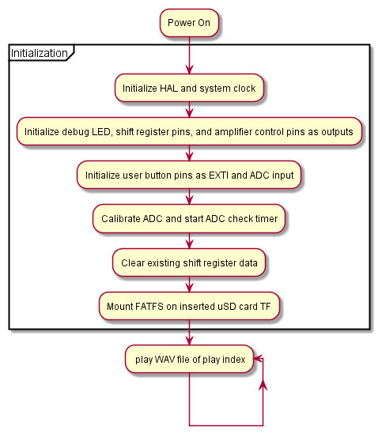

STM32 Development board with SD, SWD, 3W I2S and DAC Amplifiers, and USB-rechargeable load-sharing LiPo power.

#### A full detailing can be found [here](https://www.markhofmeister.com/stm32-audio-dev-panel) 

## Directory Structure 

## System Diagram

## PCB

## Flowchart 

 
 
 
 
 

## Mechanical View
	

